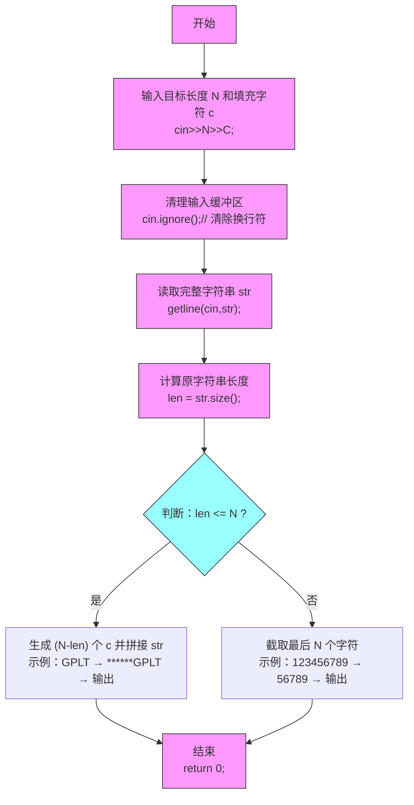

```mermaid
flowchart TD
    A["开始"] --> B["输入目标长度 N 和填充字符 c<br/>cin>>N>>C;"]
    B --> C["清理输入缓冲区<br/>cin.ignore();// 清除换行符"]
    C --> D["读取完整字符串 str<br/>getline(cin,str);"]
    D --> E["计算原字符串长度<br/>len = str.size();"]
    E --> F{"判断：len <= N ?"}
    F -->|是| G["生成 (N-len) 个 c 并拼接 str<br/>示例：GPLT → ******GPLT → 输出"]
    F -->|否| H["截取最后 N 个字符<br/>示例：123456789 → 56789 → 输出"]
    G --> I["结束<br/>return 0;"]
    H --> I

    classDef step fill:#f9f,stroke:#333,stroke-width:1px
    classDef judge fill:#9ff,stroke:#333,stroke-width:1px
    class A,B,C,D,E,I step
    class F judge
```

用 `cin` 替代 `getline` 的可能会遇到的坑：
1. **无法读取含空格的字符串**：`cin >> str` 只会读取到第一个空格 / 换行前的内容，后面的字符会被丢弃，不符合题目中 “读取完整原始字符串” 的需求。
2. **对空字符串处理异常**：`cin` 会阻塞等待输入，而 `getline` 能正确识别空字符串。
